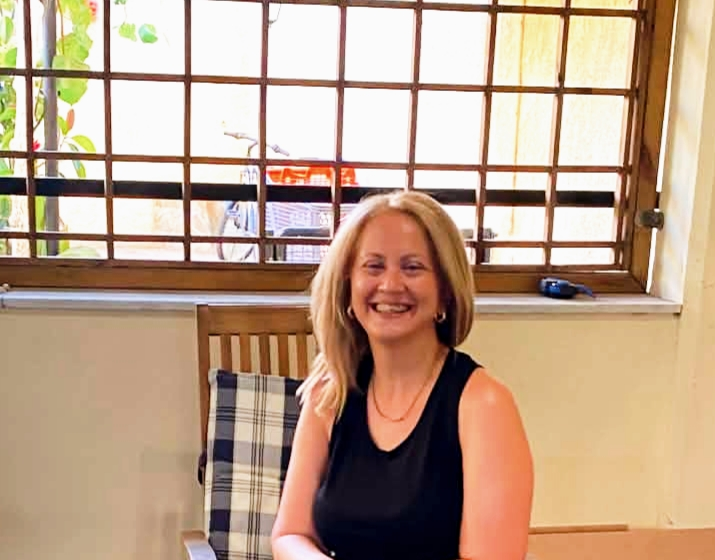

  <a href="#about">About</a>
  <a href="#research-interests">Research</a>
  <a href="#publications--conference-papers">Publications</a>
  <a href="#education">Education</a>
  <a href="#professional-experience">Experience</a>
  <a href="#professional-projects">Projects</a>
  <a href="#professional-development">Development</a>
  <a href="#languages">Languages</a>
  <a href="#cv">CV</a>
  <a href="#contact--academic-profiles">Contact</a>

  

  

    

      Assistant Librarian, Periodicals · PhD Candidate in Information Science
    

    

      The Gennadius Library, American School of Classical Studies at Athens 
      Ionian University
    

  

## About

I am an Assistant Librarian responsible for the Periodicals Collection at the Gennadius Library of the American School of Classical Studies at Athens, and a PhD Candidate in Information Science at Ionian University.

My research interests lie at the intersection of Computational Linguistics, Natural Language Processing, Computational Literary Studies, and Digital Humanities. My doctoral research investigates the capabilities and limitations of Large Language Models for context-aware emotion detection and reasoning in literary texts, with particular emphasis on implicit emotion, narrative context, relational emotion structure, cognitive appraisal, and evidence-grounded interpretation.

## Research Interests

  Computational Linguistics
  Natural Language Processing
  Large Language Models
  Emotion Detection and Emotion Reasoning
  Computational Literary Studies
  Digital Humanities
  Narrative Context
  Cognitive Appraisal
  Multilingual and Cross-Lingual Emotion Analysis
  Evidence-Grounded Emotion Reasoning

## PhD Research

**Context-Aware Emotion Detection and Reasoning in Literary Texts Using Large Language Models**

## PhD Research

<strong>Context-Aware Emotion Detection and Reasoning in Literary Texts Using Large Language Models</strong>

<em>Implicit Emotion, Narrative Context, and Cognitive Appraisal</em>

My doctoral research investigates the capabilities and limitations of Large Language Models for interpreting emotions in literary narrative, particularly when emotional meaning is implicit, context-dependent, and distributed across characters, events, and narrative perspective.

## Publications & Conference Papers

- Kalogeros, E., <strong>Rodi, M.</strong>, Stamou, S., Micheli, A., Karakitsiou, C., & Gergatsoulis, M. (2026). <em>Chasing emotion: A preliminary study of implicit and explicit emotion classification in Greek using SetFit and sentence embeddings.</em> Paper accepted for presentation at the 12th Balkan Conference in Informatics (BCI 2026), Thessaloniki, Greece, 11–14 October 2026.

- Solomonidi, I., <strong>Rodi, A.</strong>, & Tsononas, G. (2025). <em>Enabling discovery: Open access to rare historical maps and 19th-century Greek journals from the Gennadius Library collection via the library’s catalogue.</em> Paper presented at the EEBEP Conference 2025, Kalabaka, Greece, 11–13 June 2025. Manuscript submitted for inclusion in the conference proceedings.

- Giannakopoulos, G., Gkouvousi, A., Belsis, P., Paliouras, G., Papatheodorou, C., <strong>Rodi, A.</strong>, & Skourlas, C. (2007). <em>Εξατομίκευση διδασκαλίας και πληροφόρησης στην ανώτατη εκπαίδευση</em> [Personalization of teaching and information provision in higher education]. *e-Journal of Science & Technology, 2*(3), 1–18.

## Education

<strong>MSc in Information Science</strong>  
Ionian University, Department of Archives and Library Science, 2006–2008  
Master’s thesis: <em>Personalization and Content-Based Cross-Language Information Retrieval</em>

<strong>Degree in Library Science and Information Systems</strong>  
Technological Educational Institute of Athens, Department of Library Science and Information Systems, 2000–2004  
Undergraduate thesis: <em>Digital Libraries and an Overview of Greenstone Digital Library Software</em>

## Professional Experience

<strong>Assistant Librarian, Periodicals</strong>  
The Gennadius Library, American School of Classical Studies at Athens  
2014–Present

- Manage periodicals processing and cataloguing workflows in ALEPH 24, including check-in, metadata standardization, RFID processing, claims, and binding.
- Perform original and copy cataloguing of donations from private collections.
- Contribute to collection development through acquisition recommendations and the evaluation and coordination of donated materials.
- Provide reference services and orientations for new library patrons.

<strong>Serials Cataloguer</strong>  
The Gennadius Library, American School of Classical Studies at Athens  
2007–2014

- Performed retrospective cataloguing of post-revolutionary Greek and foreign periodicals and newspapers.
- Enhanced catalogue records with electronic resources and descriptions of supplementary material found within periodical publications.
- Documented inserts preserved within periodical volumes, including correspondence between Joannes Gennadius and publishers.

 <h2 id="professional-projects">Professional Projects</h2>

 

<strong>Enabling Discovery: Open Access to Rare Historical Maps and 19th-Century Greek Journals from the Gennadius Library Collection via the Library's Catalogue</strong>

<em>My contribution: Discovering 19th-Century Greek Periodicals through the Scrapbooks of Joannes Gennadius</em>

This contribution focuses on the cataloguing and digital accessibility of rare 19th-century Greek newspapers and periodicals preserved in the scrapbooks of Joannes Gennadius. It covers the preparation and management of digital objects, MARC 21 cataloguing in ALEPH v.24, integration with the AMBROSIA catalogue, and the development of an internal catalogue for the systematic management of the digitised scrapbook collection.

<em>Presented as part of the EEBEP Conference 2025 paper on open access to rare historical maps and 19th-century Greek journals from the Gennadius Library collections.</em>

## Technical Skills

MARC 21, UNIMARC, Dublin Core, BIBFRAME, EAD, RDF, XML, ISO 2709, Z39.50, ontologies and taxonomies; AACR2, RDA, ISBD, LCSH, LCC, DDC, and authority control.

ALEPH 24, Horizon, Millennium, ABEKT, OpenABEKT, ADVANCE, Koha, and DSpace.

Python and SQL at intermediate level.

## Professional Development

<strong>Introduction to Programming with Python</strong>  
University of Ioannina, Center for Continuing Education and Lifelong Learning, 2025  
Certificate of Completion · 60 hours · Distance learning

<strong>Object-Oriented Design with Unified Modeling Language (UML)</strong>  
Technological Educational Institute of Lamia, 2007–2008  
Online training course

## Languages

Greek: Native  
English: Michigan Advanced Proficiency in English; Cambridge First Certificate in English  
Italian: Basic knowledge

## CV

<a href="Rodi_Mina_cv_public_eng.pdf"
   target="_blank"
   style="
   display:inline-block;
   padding:10px 16px;
   border:1px solid #888;
   border-radius:8px;
   text-decoration:none;
   font-weight:600;
   margin-top:6px;">
  Download CV
</a>

## Contact & Academic Profiles

Email: <a href="mailto:mina.mfh@gmail.com">mina.mfh@gmail.com</a> 
ORCID: <a href="https://orcid.org/0009-0007-5313-030X" target="_blank">0009-0007-5313-030X</a>

